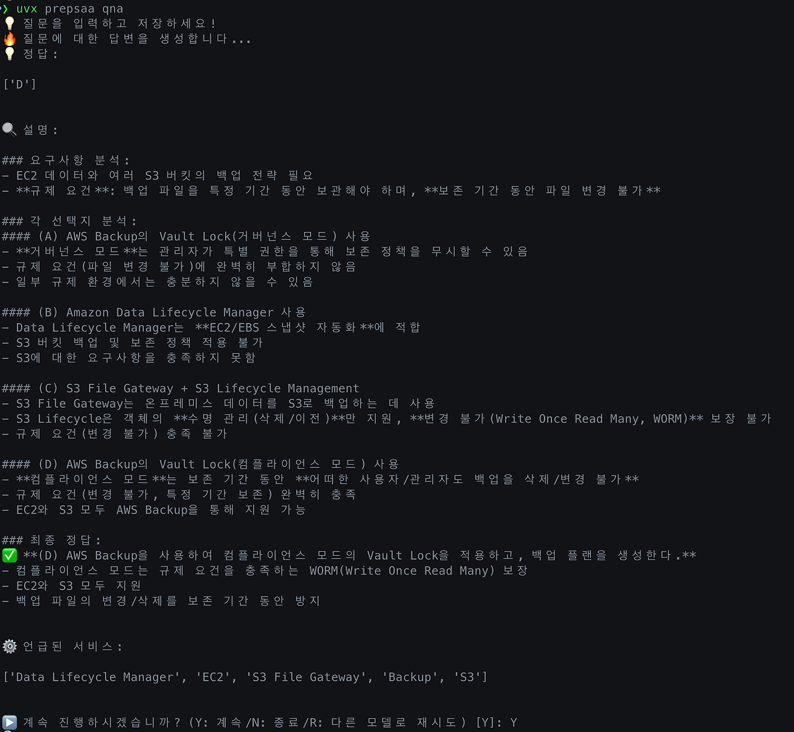
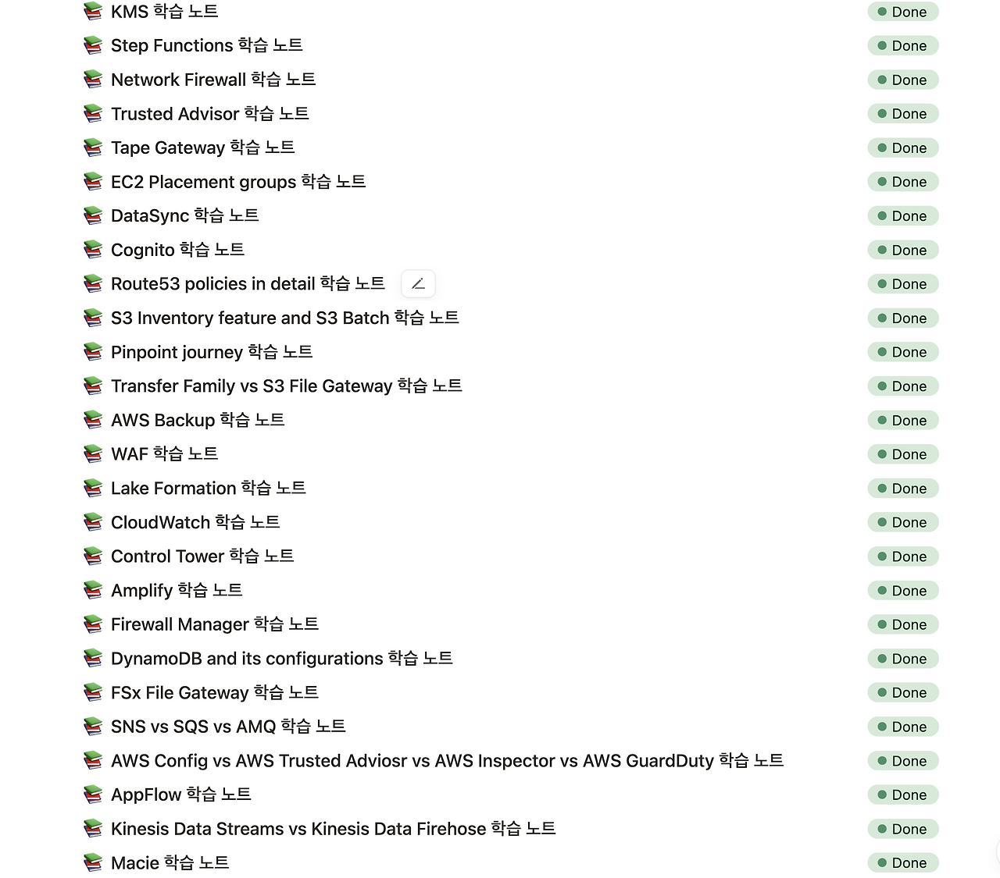
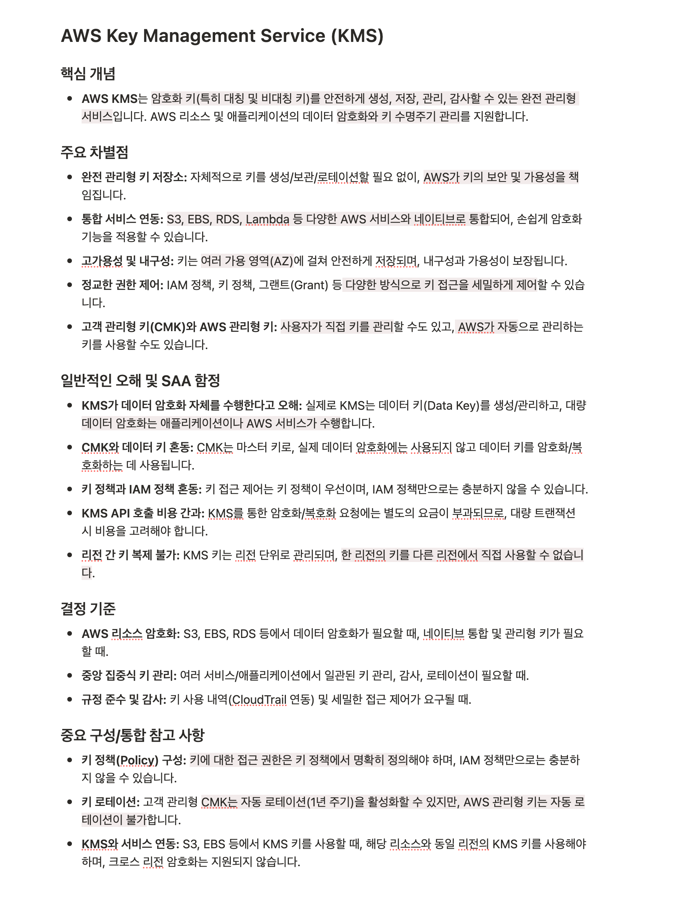

# prepsaa

## 🚀 기능 소개

- **LLM 기반 Q&A:** AWS SAA 덤프 문제를 입력하면 LLM을 활용하여 답변, 설명, 관련 AWS 서비스를 생성합니다.
- **학습 노트 자동 생성:** 질문 답변 과정에서 언급된 AWS 서비스나 직접 지정한 서비스에 대한 학습 노트를 생성합니다.
- **Notion 연동:** 생성된 Q&A 내용 및 학습 노트를 지정한 Notion 데이터베이스에 자동으로 저장합니다.

<p align="center">
  <br>
  prepsaa CLI 사용 예시 화면
</p>

## 📦 설치 방법

이 도구는 `uv`를 사용하여 설치하는 것을 권장합니다. `uv`는 Python 패키지 설치 및 관리를 위한 빠른 도구입니다.

1.  **uv 설치:**
    `uv`가 설치되어 있지 않다면, 다음 방법으로 설치할 수 있습니다 (macOS, Linux 기준):

    ```bash
    curl -LsSf https://astral.sh/uv/install.sh | sh
    ```

    다른 운영체제나 자세한 설치 방법은 [uv 공식 문서](https://github.com/astral-sh/uv#installation)를 참고하세요.

2.  **prepsaa 설치:**
    `uv` 설치후 `uvx` 명령어를 이용하여 `prepsaa` CLI를 사용할 수 있습니다.
    ```bash
    uvx prepsaa
    ```

## ⚙️ 설정

`prepsaa`를 사용하기 전에 필요한 설정을 초기화해야 합니다. 다음 명령어를 실행하면 필요한 정보(API 키 등)를 입력하라는 메시지가 표시됩니다.

```bash
prepsaa config init
```

이 과정에서 다음 정보들을 설정하게 됩니다:

- **기본 LLM 모델:** (`default_model`) 질문 답변에 사용할 기본 모델 (예: `gpt-4.1`)
- **재시도 LLM 모델:** (`alternative_model`) 기본 모델 답변이 만족스럽지 않을 때 사용할 대체 모델 (예: `o3-mini`)
- **Notion 데이터베이스 ID:** (`notion_database_id`) Q&A 및 학습 노트를 저장할 Notion 데이터베이스의 ID. 해당 데이터베이스는 `Tags`라는 이름의 멀티셀렉트 필드를 가져야 하니, 데이터베이스에 해당 필드를 추가해주세요.
- **Notion API Key:** (`notion_api_key`) Notion API 접근을 위한 통합 Key
- **Anthropic API Key:** (`anthropic_api_key`) Anthropic 모델(Claude 등) 사용 시 필요
- **OpenAI API Key:** (`openai_api_key`) OpenAI 모델(GPT 등) 사용 시 필요
- **Google API Key:** (`google_api_key`) Google 모델(Gemini 등) 사용 시 필요

설정된 내용은 `~/.config/prepsaa/config.json` 파일에 저장됩니다. 설정 파일의 위치는 다음 명령어로 확인할 수 있습니다.

```bash
uvx prepsaa config path
```

설정 파일을 삭제하려면 다음 명령어를 사용합니다.

```bash
uvx prepsaa config clean
```

## 💡 사용 방법

### 1. 질문하고 답변받기 (`qna`)

AWS SAA 관련 질문을 하고 LLM으로부터 답변, 설명, 관련 서비스 목록을 받습니다.

```bash
uvx prepsaa qna
```

명령어를 실행하면 기본 편집기가 열립니다. 질문을 입력하고 저장하면 LLM이 답변을 생성합니다.

- 답변 확인 후 `Y`를 입력하면 언급된 서비스들에 대한 학습 노트 생성 여부를 묻습니다.
- `N`을 입력하면 프로그램을 종료합니다.
- `R`을 입력하면 설정된 `alternative_model`로 변경하여 동일한 질문에 대해 다시 답변을 생성합니다.

### 2. 특정 서비스 학습 노트 생성하기 (`explain`)

원하는 AWS 서비스의 이름을 지정하여 학습 노트를 생성하고 Notion에 저장합니다.

```bash
uvx prepsaa explain "<서비스 이름>"
```

예시:

```bash
uvx prepsaa explain "Amazon S3"
```

<p align="center">
  <br>
  Notion에 저장된 학습 노트 예시
</p>

<p align="center">
  <br>
  생성된 학습 노트 상세 내용 (하이라이트는 직접 추가)
</p>

## 🙏 기여하기

개선 사항이나 버그 리포트는 언제나 환영합니다. GitHub Issues를 통해 참여해주세요.

## 📄 라이선스

[MIT License](LICENSE)
